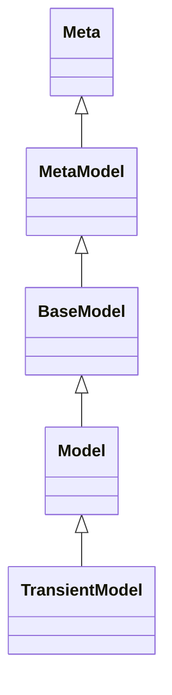

# 目录

```toc
```

# 1. 模型



- `Model`作为所有业务模型类的父类存在，例如:

```python
class user(Model):
    ...
```

- TransientModel: 作为临时数据存储在数据库中，会被定期任务清理掉
- AbstractModel: 抽象模型，被其他模型所继承

> The system automatically instantiates every model once per database. Those
> instances represent the available models on each database, and depend on
> which modules are installed on that database. The actual class of each
> instance is built from the Python classes that create and inherit from the
> corresponding model.

> Every model instance is a "recordset", i.e., an ordered collection of
> records of the model. Recordsets are returned by methods like
> :meth:`~.browse`, :meth:`~.search`, or field accesses. Records have no
> explicit representation: a record is represented as a recordset of one
> record.

Odoo针对每一个数据库，会根据模型类实例化它对应的模型对象，而每个模型对象都是一个`Recordset`(这也是为什么模型类方法中的self是一个`Recordset`的原因)。

# 2. ORM

# 3. 数据库

# 4. 装饰器

位于`api.py`中定义的模型装饰器，例如:
- `@api.model`
- `@api.multi`
- ...