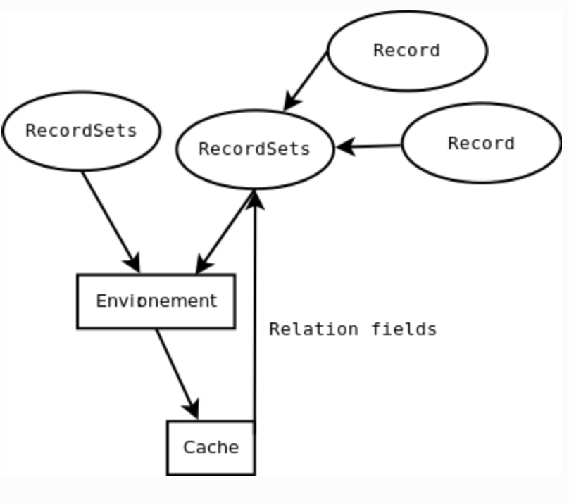

# 目录

```toc
```

# 1. self.env

> In the new API the notion of Environment is introduced. Its main objective is to provide an encapsulation around cursor, user_id, model, and context, Recordset and caches

Odoo的开发者都在模型中经常使用`self.env`中，它能够帮助开发者便捷的根据模型名称找到模型类，然后进行相应的业务操作，例如

```python
    def get_access_action(self, access_uid=None):
        """ Redirect portal users to website interface. """
        self.ensure_one()

        # 通过self.env.user获取用户
        user, record = self.env.user, self
        if access_uid:
            # 通过self.env['res.users']获取res.users模型类
            user = self.env['res.users'].sudo().browse(access_uid)
            record = self.sudo(user)
        if user.share:
            return {
                'type': 'ir.actions.act_url',
                'url': record.access_url,
                'target': 'self',
                'res_id': self.id,
```

它最早是在[Odoo 8.0的时候作为全新ORM API](https://odoo-new-api-guide-line.readthedocs.io/en/latest/environment.html#)引入的，用来封装底层的一些信息，提供便捷的API供应用访问，包括：

- 数据库cursor
- 用户ID
- 模型
- 上下文context
- 记录集RecordSet
- 记录缓存cache



核心问题：
- `self.env`是什么？
- 为什么引入`self.env`?
- `self.env`背后的设计思想/模式是什么？

# 2. self.env是什么

根据[官方文档](https://odoo-new-api-guide-line.readthedocs.io/en/latest/environment.html#)记载，`self.env`本质上是`api.Environment`的一个对象:

```python
class Environment(Mapping):
    """ An environment wraps data for ORM records:

        - :attr:`cr`, the current database cursor;
        - :attr:`uid`, the current user id;
        - :attr:`context`, the current context dictionary.

        It provides access to the registry by implementing a mapping from model
        names to new api models. It also holds a cache for records, and a data
        structure to manage recomputations.
    """
```

从上面代码可以看到，它封装了`cr`, `uid`以及`context`。

## 2.1 self.env初始化


# 3. 为什么引入self.env?


# 4. 设计思想/模式