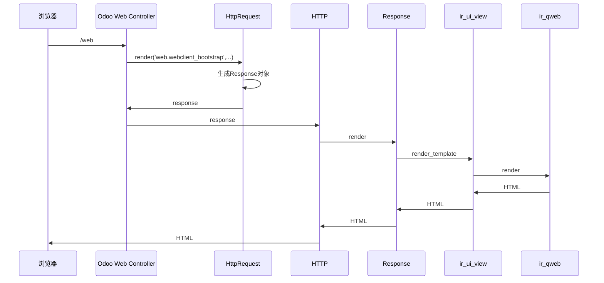

# 流程



# 视图

在Odoo中，所有的视图都是通过XML进行定义，Odoo会解析这些XML文件，并将其作为一条`ir.ui.view`记录保存在数据库中。

```python
class View(models.Model):
    _name = 'ir.ui.view'
    _description = 'View'
    _order = "priority,name,id"

    ...
```